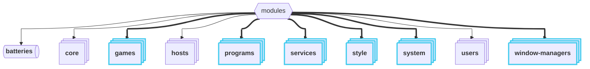
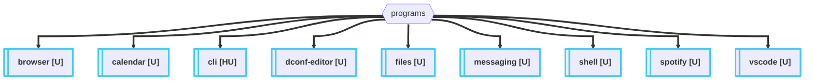
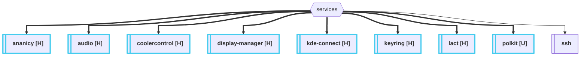

# Documentation

This documentation is currently WIP. So far all programs and services have finished documentation.

---

### Aspect Naming Convention

Aspect (folder) names may include a suffix: `[H]`, `[U]`, or `[HU]`. This indicates both that it is a consumable, predefined aspect and whether its contents are designed for hosts, users, or both.

| Suffix | Target Context | Usage Instructions |
|---|---|---|
| **[H]** | **Hosts** | Include in hosts. |
| **[U]** | **Users** | Include in users. |
| **[HU]** | **Both** | Include in both for full functionality (contains sub-aspects for both). |

---

### Aspect Index

<b>Flake Structure</b>

> Highlighted directories indicate that they contain consumable aspects.

#### Programs

<b>View Programs Aspect Structure</b>

Most of these aspects are generally intended for **users**, but some are desinged for hosts.

- [Web Browsers (browser)](../../wiki/browser)
- [Calendars (calendar)](../../wiki/calendar)
- [CLI-Tools (cli)](../../wiki/cli)
- [Dconf Debugging (dconf-editor)](../../wiki/dconf-editor)
- [File Explorers (files)](../../wiki/files)
- [Github tools (git)](../../wiki/git)
- [Messaging Applications (messaging)](../../wiki/messaging)
- [Shells & Shell Addons (shell)](../../wiki/shell)
- [Spotify Music Player (spotify)](../../wiki/spotify)
- [Terminal Emulators (terminal)](../../wiki/terminal)
- [Coding (vscode)](../../wiki/vscode)

#### Services

<b>View Services Aspect Structure</b>

Most of these aspects are generally intended for **hosts**, but some are desinged for users.

- [Auto Nice Daemon (ananicy)](../../wiki/ananicy)
- [Audio Services (audio)](../../wiki/audio)
- [CoolerControl (coolercontrol)](../../wiki/coolercontrol)
- [Display Managers (display-manager)](../../wiki/display-manager)
- [KDE Connect (kde-connect)](../../wiki/kde-connect)
- [Keyring Services (keyring)](../../wiki/keyring)
- [LACT GPU Monitoring (lact)](../../wiki/lact)
- [Polkit Services (polkit)](../../wiki/polkit)
- [SSH Services (ssh)](../../wiki/ssh)